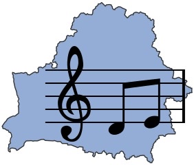
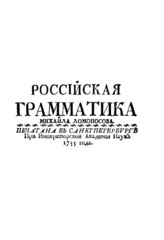
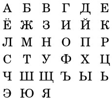

&nbsp;

&nbsp;

&nbsp;

<h1 style="text-align: center;">&nbsp;Welcome</h1>
 

&nbsp;

&nbsp;

  <html>
  <head>
    <title>Center an Image using text align center</title>
    
  </head>
  <body>
    
 <!-- Block parent element -->
      

    

  </body>
</html>
  
  

&nbsp;

&nbsp;

&nbsp;

If you want to improve your Russian then you have come to the right place! Russian with Beatrix offers free resources to help you in your Russian learning process and don&rsquo;t forget to test your knowledge through our flashcards, quizzes and more!

&nbsp;

<h3><strong>Phonetics</strong>&nbsp;</h3>

<!-- Block parent element --> 

&nbsp;

Phonetics are how words are spoken and each language has a different set of phonetics (although, some will overlap with each other!) Mastering the phonetics of a language will help you to sound like a native and elevate your level of speech. If you want to sound like a native Russian speaker&nbsp;<a href="https://sml5202-20-beatrix.github.io/SML5202-final-Beatrix/page2.html">click here&nbsp;</a>to view the guide.

&nbsp;

&nbsp;

<h3><strong>Grammar Tables</strong></h3>

&nbsp;

<!-- Block parent element --> 

&nbsp;

The Russian language contains a grammar system of declensions, whereby the ending of a word changes depending on the appropriate case or gender. Grasping this system is one of the biggest hurdles in becoming fluent in the language. If you want to learn the endings or would like to brush up on your grammar: <a href="https://sml5202-20-beatrix.github.io/SML5202-final-Beatrix/page3.html">click here</a>. to view the grammar tables.

&nbsp;

<h3><strong>Vocabulary</strong></h3>

&nbsp;

<!-- Block parent element --> 

&nbsp;

Building a good vocabulary is key in language fluency. If you are looking to improve your vocabulary skills, <a href="https://sml5202-20-beatrix.github.io/SML5202-final-Beatrix/page4.html">click here</a>.

&nbsp;

<h3><strong>Russian Culture</strong></h3>

&nbsp;

<!-- Block parent element --> 

&nbsp;

Understanding culture is an important part of the language learning process. Culture can teach you about the values, traditions and histories of a people. To learn more about Russian culture: <a href="https://sml5202-20-beatrix.github.io/SML5202-final-Beatrix/page5.html">Click Here</a>.

&nbsp;

&nbsp;

<h3><strong>Russian Keyboard</strong></h3>

&nbsp;

<html  lang="ru">
<head>

<meta charset="utf-8">

<title>keyboard</title>

</head>
<body>

<input type="button" value="Й" /> <input type="button" value="Ц" /> <input type="button" value="У" /> <input type="button" value="К" /> <input type="button" value="Е" /> <input type="button" value="Н" /> <input type="button" value="Г" /> <input type="button" value="Ш" /> <input type="button" value="Щ" /> <input type="button" value="З" /> <input type="button" value="Х" /> <input type="button" value="Ё" />

<input type="button" value="Ф" /> <input type="button" value="Ы" /> <input type="button" value="В" /> <input type="button" value="А" /> <input type="button" value="П" /> <input type="button" value="О" /> <input type="button" value="Л" /> <input type="button" value="Д" /> <input type="button" value="Ж" /> <input type="button" value="Э" />

<input type="button" value="Я" /> <input type="button" value="Ч" /> <input type="button" value="С" /> <input type="button" value="М" /> <input type="button" value="И" /> <input type="button" value="Т" /> <input type="button" value="Ь" /> <input type="button" value="Б" /> <input type="button" value="Ю" />

<input id="space" type="button" value=" " /> <input id="clear" type="reset" value="clear" />

<label>Track Search</label> - <input id="text" readonly="readonly" type="text" />

<!-- end #keyboard -->

&nbsp;

&nbsp;

<h3>Recommended Resources for Beginner Learning:</h3>

&nbsp;

<ul>
<li style="font-weight: 400;" aria-level="1">Beginner&rsquo;s Russian with Interactive Online Workbook:&nbsp;<a href="https://www.amazon.co.uk/gp/product/0781812518/ref=ppx_yo_dt_b_asin_title_o08_s00?ie=UTF8&amp;psc=1">https://www.amazon.co.uk/gp/product/0781812518/ref=ppx_yo_dt_b_asin_title_o08_s00?ie=UTF8&amp;psc=1</a></li>
<li style="font-weight: 400;" aria-level="1">Russian Grammar Workbook:&nbsp;<a href="https://www.amazon.co.uk/gp/product/1118273419/ref=ppx_yo_dt_b_search_asin_title?ie=UTF8&amp;psc=1">https://www.amazon.co.uk/gp/product/1118273419/ref=ppx_yo_dt_b_search_asin_title?ie=UTF8&amp;psc=1</a></li>
<li style="font-weight: 400;" aria-level="1">Oxford Russian Grammar and Verbs:&nbsp;<a href="https://www.amazon.co.uk/gp/product/0198603800/ref=ppx_yo_dt_b_search_asin_title?ie=UTF8&amp;psc=1">https://www.amazon.co.uk/gp/product/0198603800/ref=ppx_yo_dt_b_search_asin_title?ie=UTF8&amp;psc=1</a></li>
<li style="font-weight: 400;" aria-level="1">Oxford Essential Russian - English Dictionary:&nbsp;<a href="https://www.amazon.co.uk/gp/product/0199576432/ref=ppx_yo_dt_b_search_asin_title?ie=UTF8&amp;psc=1">https://www.amazon.co.uk/gp/product/0199576432/ref=ppx_yo_dt_b_search_asin_title?ie=UTF8&amp;psc=1</a></li>
</ul>

&nbsp;

&nbsp;

&nbsp;

&nbsp;

&nbsp;

190419569   

