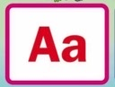
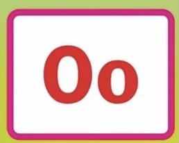
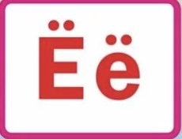

<!-- COMMENT: To add items to the columns, simply copy an existing item with its 

 tags. For example 
Актёр - actor
, and then paste it before the </td> tag of the section. There are some empty 

 tags for you to use as well. These are marked: 
&nbsp;
, so you can insert items in place of the &nbsp; part. END OF COMMENT -->

<!-- THIS IS THE FIRST TABLE -->

<h1>Phonetics</h1>

<table class="table table-striped">
<thead>
<tr>
<th><h3>Vowels</h3></th>
<th><h3>Consonants</h3></th>
<th><h3>Unstressed and Devoiced Phonetics</h3></th>
</tr>
</thead>
<tbody>
<tr>

&nbsp;

<td>
    
 

    

      
      

          
A = A like in f<strong>a</strong>r

        

    

  

 
  <audio controls>
  <source src="Phonetics A.mp3" type="audio/mpeg">
  Your browser does not support the audio tag.
</audio>

&nbsp;

    

      
      

          
O = O like in <strong>o</strong>kay

        

    

  

 
  <audio controls>
  <source src="audio-file/О.m4a" type="audio/mpeg">
  Your browser does not support the audio tag.
</audio>

&nbsp;

    

      
      

          
Е = Е like in <strong>ye</strong>t

        

    

  

 
  <audio controls>
  <source src="audio-file/Е.m4a" type="audio/mpeg">
  Your browser does not support the audio tag.
</audio>

&nbsp;

    

      
      

          
И = I like in f<strong>ee</strong>t

        

    

  

 
  <audio controls>
  <source src="audio-file/И.m4a" type="audio/mpeg">
  Your browser does not support the audio tag.
</audio>

&nbsp;

    

      
      

          
 У= oo like in f<strong>oo</strong>d

        

    

  

 
  <audio controls>
  <source src="audio-file/У.m4a" type="audio/mpeg">
  Your browser does not support the audio tag.
</audio>

&nbsp;

    

      
      

          
 Э= eh like in m<strong>e</strong>t

        

    

  

 
  <audio controls>
  <source src="audio-file/Э.m4a" type="audio/mpeg">
  Your browser does not support the audio tag.
</audio>

</td>

<td>
    
 

    

      
      

          
М = M like in <strong>m</strong>ilk

        

    

  

 
  <audio controls>
  <source src="audio-file/М.m4a" type="audio/mpeg">
  Your browser does not support the audio tag.
</audio>

&nbsp;

    

      
      

          
К = K like in moc<strong>k</strong>

        

    

  

 
  <audio controls>
  <source src="audio-file/К.m4a" type="audio/mpeg">
  Your browser does not support the audio tag.
</audio>

&nbsp;

    

      
      

          
Т = T like in <strong>t</strong>oas<strong>t</strong>

        

    

  

 
  <audio controls>
  <source src="audio-file/Т.m4a" type="audio/mpeg">
  Your browser does not support the audio tag.
</audio>

&nbsp;

    

      
      

          
Н = N like in <strong>n</strong>ame

        

    

  

 
  <audio controls>
  <source src="audio-file/Н.m4a" type="audio/mpeg">
  Your browser does not support the audio tag.
</audio>

&nbsp;

    

      
      

          
С = S like in <strong>s</strong>ea

        

    

  

 
  <audio controls>
  <source src="audio-file/С.m4a" type="audio/mpeg">
  Your browser does not support the audio tag.
</audio>

&nbsp;

    

      
      

          
Л = L like in <strong>l</strong>emon

        

    

  

 
  <audio controls>
  <source src="audio-file/Л.m4a" type="audio/mpeg">
  Your browser does not support the audio tag.
</audio>

&nbsp;

    

      
      

          
Р = R like in <strong>r</strong>oll

        

    

  

 
  <audio controls>
  <source src="audio-file/Р.m4a" type="audio/mpeg">
  Your browser does not support the audio tag.
</audio>

&nbsp;

    

      
      

          
В = V like in <strong>v</strong>an

        

    

  

 
  <audio controls>
  <source src="audio-file/В.m4a" type="audio/mpeg">
  Your browser does not support the audio tag.
</audio>

&nbsp;

    

      
      

          
Б = B like in <strong>B</strong>ox

        

    

  

 
  <audio controls>
  <source src="audio-file/Б.m4a" type="audio/mpeg">
  Your browser does not support the audio tag.
</audio>

&nbsp;

    

      
      

          
П = P like in <strong>p</strong>ull

        

    

  

 
  <audio controls>
  <source src="audio-file/П.m4a" type="audio/mpeg">
  Your browser does not support the audio tag.
</audio>

&nbsp;

    

      
      

          
Д = D like in <strong>d</strong>og

        

    

  

 
  <audio controls>
  <source src="audio-file/Д.m4a" type="audio/mpeg">
  Your browser does not support the audio tag.
</audio>

&nbsp;

    

      
      

          
Г = G like in <strong>g</strong>oose

        

    

  

 
  <audio controls>
  <source src="audio-file/Г.m4a" type="audio/mpeg">
  Your browser does not support the audio tag.
</audio>

&nbsp;

    

      
      

          
Ф = F like in <strong>f</strong>ace

        

    

  

 
  <audio controls>
  <source src="audio-file/Ф.m4a" type="audio/mpeg">
  Your browser does not support the audio tag.
</audio>

&nbsp;

    

      
      

          
Х = CH like in lo<strong>ch</strong>

        

    

  

 
  <audio controls>
  <source src="audio-file/Х.m4a" type="audio/mpeg">
  Your browser does not support the audio tag.
</audio>

&nbsp;

    

      
      

          
З = Z like in <strong>z</strong>oo

        

    

  

 
  <audio controls>
  <source src="audio-file/З.m4a" type="audio/mpeg">
  Your browser does not support the audio tag.
</audio>

&nbsp;

    

      
      

          
Ж = ZH like in clo<strong>su</strong>re

        

    

  

 
  <audio controls>
  <source src="audio-file/Ж.m4a" type="audio/mpeg">
  Your browser does not support the audio tag.
</audio>

&nbsp;

    

      
      

          
Щ = SCH like in <strong>sh</strong>oe/p>
        

    

  

 
  <audio controls>
  <source src="audio-file/Щ.m4a" type="audio/mpeg">
  Your browser does not support the audio tag.
</audio>

&nbsp;

    

      
      

          
Ч = CH like in <strong>ch</strong>urch

        

    

  

 
  <audio controls>
  <source src="audio-file/Ч.m4a" type="audio/mpeg">
  Your browser does not support the audio tag.
</audio>

&nbsp;

    

      
      

          
Ц = TS like in ha<strong>ts</strong>

        

    

  

 
  <audio controls>
  <source src="audio-file/Ц.m4a" type="audio/mpeg">
  Your browser does not support the audio tag.
</audio>

&nbsp;

    

      
      

          
Й = Y like in <strong>y</strong>oghurt

        

    

  

  <audio controls>
  <source src="audio-file/Й.m4a" type="audio/mpeg">
  Your browser does not support the audio tag.
</audio>
 
&nbsp;

 
 

    

      
      

          
Я = YA like in <strong>ya</strong>rd

        

    

  

 
  <audio controls>
  <source src="audio-file/Я.m4a" type="audio/mpeg">
  Your browser does not support the audio tag.
</audio>

&nbsp;

    

      
      

          
Ё = YO like in <strong>yo</strong>rk

        

    

  

 
  <audio controls>
  <source src="audio-file/Ё.m4a" type="audio/mpeg">
  Your browser does not support the audio tag.
</audio>

&nbsp;

    

      
      

          
Ю = YU like in <strong>u</strong>nicorn

        

    

  

 
  <audio controls>
  <source src="audio-file/Ю.m4a" type="audio/mpeg">
  Your browser does not support the audio tag.
</audio>

&nbsp;

    

      
      

          
Ы = close to ill

        

    

  

  <audio controls>
  <source src="audio-file/Ы.m4a" type="audio/mpeg">
  Your browser does not support the audio tag.
</audio> 

&nbsp;

&nbsp;

</td>

<td>
   

    

      

          
An unstressed <strong>о</strong> becomes <strong>а</strong>

        

    

  

 
  <audio controls>
  <source src="audio-file/О-a.m4a" type="audio/mpeg">
  Your browser does not support the audio tag.
</audio>

&nbsp;

    

      

          
Unstressed <strong>E</strong> or <strong>Я</strong> becomes <strong>ye</strong>

        

    

  

 
  <audio controls>
  <source src="audio-file/Е:Я - ye.m4a" type="audio/mpeg">
  Your browser does not support the audio tag.
</audio>

&nbsp;

    

      

          
Unstressed <strong>E</strong> or <strong>Я</strong> becomes <strong>ee</strong>

        

    

  

 
  <audio controls>
  <source src="audio-file/Е:Я-ee.m4a" type="audio/mpeg">
  Your browser does not support the audio tag.
</audio>

&nbsp;

    

      

          
Some consonants have voice and voiceless pairs

          
 Б becomes <strong>П</strong>

          
В becomes <strong>Ф</strong>

          
Г becomes <strong>К</strong>

          
Д becomes <strong>Т</strong>

          
З becomes <strong>С</strong>

          
Ж becomes <strong>Ш</strong>

        

    

  

 
  <audio controls>
  <source src="audio-file/Voiced:Voiceless.m4a" type="audio/mpeg">
  Your browser does not support the audio tag.
</audio>

</td>
</tr>
</tbody>
</table>
<table></table>

<html>
<head>
<meta name="viewport" content="width=device-width, initial-scale=1">

</head>
<body>

<h2>Practice your pronunciation:</h2>

  

    <h2></h2>
    
<ul>
<li>До́м</li>
<li>Сто́л</li>
<li>Са́д</li>
<li>Ча́й</li>
<li>Во́дка</li>
<li>Сви́тер</li>
<li>Ко́фе</li>
<li>Кри́зисс</li>
<li>Кни́га</li>
<li>Вино́</li>
<li>Язы́к</li>
<li>Футбо́л</li>
<li>Гара́ж</li>
<li>Журна́л</li>
<li>У́лица</li>
<li>Мужчи́на</li>
<li>Компью́тер</li>
<li>Друг</li>
<li>Газе́та</li>
<li>Профе́ссор</li>
<li>Телефо́н</li>
</ul>

  

  

    <h2></h2>
    
<ul>
<li>Ка́мера</li>
<li>Ди́ск</li>
<li>Па́рк</li>
<li>Сто́п</li>
<li>Пи́во</li>
<li>Мы́шка</li>
<li>О́фис</li>
<li>А́дрес</li>
<li>Го́род</li>
<li>Партн́ёр</li>
<li>Кафе́</li>
<li>Сала́т</li>
<li>Война́</li>
<li>Теа́тр</li>
<li>О́пера</li>
<li>Магази́н</li>
<li>Колле́га</li>
<li>Маши́на</li>
<li>Кварти́ра</li>
<li>Прoграмми́ст</li>
<li>Президе́нт</li>
</ul>

  

</body>
</html>

&nbsp;

&nbsp;

&nbsp;

&nbsp;

&nbsp;

&nbsp;

<iframe src="https://ml19239.h5p.com/content/1291217383487173897/embed" width="1088" height="637" frameborder="0" allowfullscreen="allowfullscreen" allow="geolocation *; microphone *; camera *; midi *; encrypted-media *"></iframe>

<html>
<head>

</head>
<body>

<button class="button button1"><a href="https://sml5202-20-beatrix.github.io/SML5202-final-Beatrix/" style="color:white">Back to Home Page</a></button>
<button class="button button2"><a href="https://sml5202-20-beatrix.github.io/SML5202-final-Beatrix/page3.html" style="color:white">Next Page</a></button>

</body>
</html>
