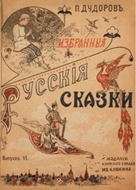
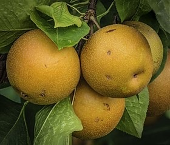
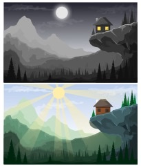

<h1>Vocabulary</h1>

<!-- COMMENT: To add items to the columns, simply copy an existing item with its 

 tags. For example 
Актёр - actor
, and then paste it before the </td> tag of the section. There are some empty 

 tags for you to use as well. These are marked: 
&nbsp;
, so you can insert items in place of the &nbsp; part. END OF COMMENT -->

<!-- THIS IS THE FIRST TABLE -->
<html>
<head>
<meta name="viewport" content="width=device-width, initial-scale=1">

</head>
<body>
<h3>Part 1</h3>

 

<table class="table table-striped">
<thead>
<tr>
<th>Occupations</th>
<th>People</th>
<th>Places</th>
</tr>
</thead>
<tbody>
<tr>
<td>

&nbsp;

  
Администра́тор – administrator

  
Актёр/Актри́са – actress

  
Архите́ктор – architect

  
Бухга́лтер – accountant

  
Врач – doctor

  
Данти́ст – dentist

  
Диза́йнер – designer

  
Дире́ктор – director

  
Домохозя́йка – housewife

  
Журнали́ст/Журнали́стка – journalist

  
Инспе́ктор – inspector

  
Инстру́ктор – instructor

  
Конду́ктор –  train conductor

  
Ме́неджер – manager

  
Пенсионе́р – retired, pensioner

  
Поли́тик – politician

  
Преподава́тель – teacher

  
Программи́ст – programmer

  
Секрета́рь – secretary

  
Спортсме́н/Спортсме́нка – athlete

  
Экономи́ст – economist

  
Юри́ст – lawyer

&nbsp;

&nbsp;

</td>
<td>
  

  
Аудито́рия - audience

Ба́бушка – grandmother

Босс – boss

Брат – brother

Де́вушка – girl

Де́душка – grandfather

Дочь – daughter

Друг – friend

Дя́дя – uncle

Жена́ – wife

Клие́нт – client

Колле́га – colleague

Ма́ма – mother

Муж – husband

Па́па – father

Партнёр – partner

Ребёнок – child

Роди́тель – parent

Ру́сский – Russian

Семья́ – family

Сестра́ – sister

  
Сын – son

Тётя – aunt

  

&nbsp;

&nbsp;

</td>
<td>

Аудито́рия - lecture hall

Бар – bar

Би́ржа – stock exchange

Вокза́л – train station

Вход – entrance

Го́род – city

Дом – house

Казино́ – casino

Кана́л – canal

Кафе́ – café

Кинотеа́тр – movie theater

Клуб – club

Ко́мната – room

Магази́н – shop

Метро́ – underground train

Мо́ре – sea

Музе́й – museum

О́стров – island

Оте́ль – hotel

О́фис – office

Парк – park

Стадио́н – stadium

Страна́ – country

Теа́тр – theater

У́лица – street

Центр – center

Шко́ла – school

&nbsp;

&nbsp;

</td>
</tr>
</tbody>
</table>

<!-- THIS IS THE SECOND TABLE -->
<!-- COMMENT: If you want to make a third table, just copy everything below here and paste it after -->
<h3>Part 2</h3>

 

<table class="table table-striped">
<thead>
<tr>
<th>Verbs</th>
<th>Pronouns</th>
<th>Prepositions, Connectives/Conjunctions and Question Words</th>
</tr>
</thead>
<tbody>
<tr>
<td>

Говори́ть – to speak

Де́лать – to do

  
Есть – 1. to<strong> be</strong> (e.g Тут есть парк = There <strong>is</strong> a park here) 2. to<strong> have</strong>

Знать – to know

Обе́дать – to have dinner

Отдыха́ть – to relax

Показа́ть – to show

Понима́ть – to understand

Рабо́тать – to work

Рассказа́ть  – to tell

Слу́шать – to listen

  
Смотре́ть – to look, to watch

Спать – to sleep

Чита́ть – to read

&nbsp;

&nbsp;

</td>
<td>

Все – all, everything

Вы – you (formal/pl.)

Мы – we

Мой – my

Кто – who

Он – he

Она́ – she

Они́ – they

Оно́ – it

Ты – you (informal)

Чей (чья, чьё, чьи) – whose

Что – what

Это – it

Я – I

&nbsp;

&nbsp;

</td>

<td>

А – and, but

В (+prep.) – in

Где – where

И – and

Из (+gen.) – from

Как – how

Когда́ – when

На (+prep.) – on, at

Но – but

Но́вый – new

Норма́льно – ok, normal

Обы́чно – usually

Отку́да – where from

Сейча́с – now

Ско́лько – how many/how much

Так – so

То́же – also

То́лько – only

У – at

Ча́сто – often

Чей (чья, чьё, чьи) – whose

Что – what

&nbsp;

&nbsp;

</td>
</tr>
</tbody>
</table>

<h3>Part 3</h3>

 

<table class="table table-striped">
<thead>
<tr>
<th>Adjectives and Adverbs</th>
<th>Food and Drink</th>
<th>Objects</th>
</tr>
</thead>
<tbody>
<tr>
<td>

Аналити́ческий – analytical

Большо́й – big

До́брый – kind, good

Интере́сно – interesting

Ка́ждый – every, each

Ка́чественный – quality

Компью́терный – computer (adj.)

Красивый - beautiful

Мно́го – many, much

Обы́чно – usually

Прия́тно – pleasant

Спорти́вный – sporty

Хоро́ший – good, fine, nice

Хорошо́ – ok, good, well

Чуть-чуть (informal)– a little bit

&nbsp;

&nbsp;

</td>
  
  
<td>

Апельсин - orange

Банан

Блин - pancake

Бутербро́д – sandwich

Вино́ - wine

Вода́ – water

Йо́гурт – yogurt

Ко́фе – coffee

Лук - onion

Молоко́ - milk

Морковь - Carrot

Мясо - meat

Пи́во – beer

Помидор  - Tomato

Рис - rice

Рыба - fish

Са́хар – sugar

Сыр - cheese

Хлеб - bread

Чай – tea

Яблоко - apple

яйцо - egg

&nbsp;

&nbsp;

</td>

<td>

Биле́т – ticket

Бюро́ – bureau

Газе́та – newspaper

Дверь – door

Де́ньги – money

Джи́нсы – jeans

Журна́л – magazine

Ка́рта – 1. map 2. Card

Кино́ – movie

Кни́га – book

Компью́тер – computer

Ла́мпа – lamp

Очки́ – glasses

Ра́дио – radio

Ру́чка – pen

Стул – chair

Су́мка – bag

Фо́то – photo

Футбо́л – football

Часы́ – clock, watch

Экра́н – screen

&nbsp;

&nbsp;

</td>
</tr>
</tbody>
</table>

<h3>Part 4</h3>

 

<table class="table table-striped">
<thead>
<tr>
<th>Time and Direction</th>
<th>Greetings and Basic Terms</th>
<th>Other</th>
</tr>
</thead>
<tbody>
<tr>
<td>

Ве́чер – evening

Восто́к – east

Вре́мя – time

День – day

За́пад – west

Здесь – here

Ночь – night

Се́вер – north

Там - there

У́тро – morning

Юг – south

&nbsp;

&nbsp;

</td>
<td>

Да – yes

Дава́й – let's

До свида́ния – goodbye

Здра́вствуйте – hello

Извини́те – excuse me; I'm sorry

Пока́(informal) – bye! 

Приве́т (informal)– hello

Спаси́бо – thank you

&nbsp;

&nbsp;

</td>

<td>

Бале́т – ballet

Вечери́нка – party

Вме́сте – together

Встре́ча – meeting

Душа́ – soul

Интерне́т – Internet

Кот – cat

Ле́кция – lecture

Му́зыка – music

Но́вость(-и) – news

О́пера – opera

Пробле́ма – problem

Рабо́та – work, job

Сериа́л – TV series

Систе́ма – system

Слова́рь – dictionary, vocabulary

Соба́ка – dog

Спорт – sport

Шу́тка – joke

&nbsp;

&nbsp;

</td>
</tr>
</tbody>
</table>

