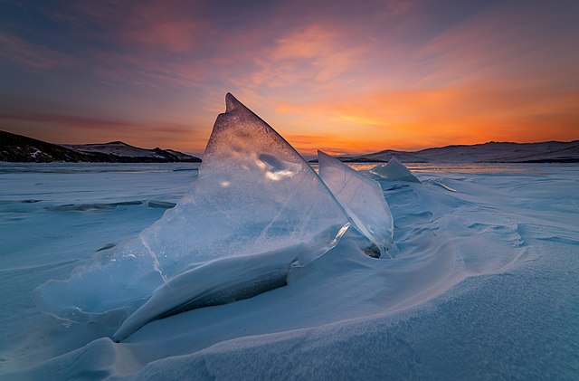
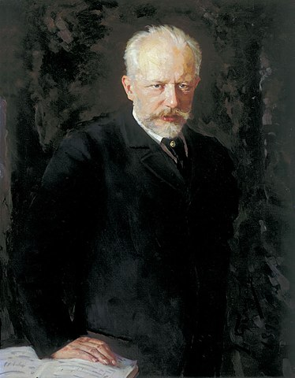
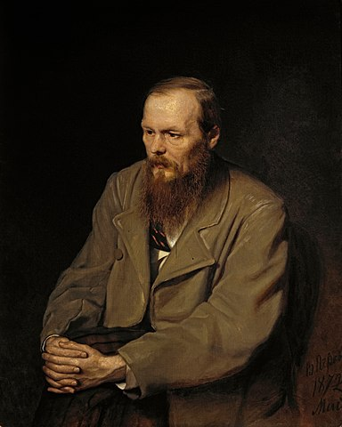

<h1>Russian Culture</h1>

Information on Russian Culture

<iframe width="560" height="315" src="https://www.youtube.com/embed/mORJmK1Ljgk" frameborder="0" allow="accelerometer; autoplay; clipboard-write; encrypted-media; gyroscope; picture-in-picture" allowfullscreen></iframe>

<h2>Red Square - Красная Площадь</h2>

The example on this page shows image and text arranged in two columns

<!-- 
COMMENTS: The code below is for a two column layout with image on the left and text on the right.
The page is divided into 12 possible units. So in this example, the left column is 5 units wide and the right column is 7 units wide. This is done using the col-sm-5 and col-sm-7, which you can see below. 
If you want the image column and text column to be equal widths, change both col-sm entries to col-sm-6 each. You can try different numbers as long as the two numbers are equal to 12.
I've also included paragraph tags and bullet list tags in the text section, so you can see how they work.
END OF COMMENTS --> 
<!-- Copy all of the code from below here -->

    

      
    

    

    
 Red Square is one of Russia’s most famous landmarks and a UNESCO World Heritage Site. Tourists come here every year to see the Kremlin walls, St Basil’s Cathedral and Lenin’s Mausoleum. The square originated as a slum until Prince Ivan III ordered the square to be cleared in the late 1400’s. The Red Square became infamous for hosting military parades during the Soviet era, most notably the parades of 7th November 1941 and 24th June 1945.

 <strong>Fun Fact:</strong> The ‘red’ in Red Square does not refer to the colour or communism. It derives from the word ‘krasny - красный’ which meant ‘beautiful’ in old Russian - however in contemporary Russian ‘krasny - красный’ means red. Hence the Red Square.

   

  

&nbsp;

<h2> Pirozhki - Пирожки</h2>

    

      
    

    

    
 Pirozhkis are baked/fried dough filled with sweet or savoury fillings. These buns originate from Russia but are commonly found across Eastern Europe, Central Asia and even Finland, Mongolia and Iran!
     
 
 Here are some  Pirozhki recipes, so that you can give it a go:

<ul>
    <li><a href="https://www.expresstorussia.com/experience-russia/traditional-russian-pies.html">Express to Russia</a></li>
    <li> <a href="https://valentinascorner.com/meat-piroshki-recipe/">Valentina's Corner</a></li>
    <li> <a href="https://www.sweetandsavorybyshinee.com/russian-piroshki-meat-hand-pies/">Sweet and Sweet and Savoury by Shinee</a> </li> 
</ul>
   

  

  
  
  
&nbsp;

  <h2>Lake Baikal - Озеро Байкал</h2>
  
  
  

    

      
    

    

    
 Lake Baikal is one of the oldest lakes in the world, ageing at least 25 million years old. This UNESCO World Heritage Site is located in South-Central Russia near the city of Irkutsk.  During the summer, after the ice from the mountains has melted, the lake is so clear that it is possible to see up to 130 feet down. The lake contains 27 islands that are mostly uninhabited and a stunning array of flora and fauna.

 <strong>Fun Fact:</strong> The lake contains 20% of the world’s freshwater supply.

   

  

  
  
  
  
&nbsp;

  
  <h2>Pyotr Tchaikovsky - Пётр Чайковский</h2>
  
  

    

      
    

    

        
  

    

    

    

    

<ul>
    <li>Born: 25th April/7th May 1840, Votkinsk, Russia</li>
    <li> Death: 25th October/6th November 1893, St. Petersburg, Russia</li>       
</ul>
 
Pyotr Ilyich Tchaikovsky was a Russian composer famous for his composition of Swan Lake (1877), The Sleeping Beauty (1889), The Nutcracker (1892) and the overture for Romeo and Juliet (1870).

 <strong>Fun Fact:</strong> Despite being a music prodigy (composing his first piece at the age 4), Tchaikovsky trained to be a civil servant.

   

  

  
  
  
&nbsp;

  
   <h2>Fyodor Dostoevsky - Фёдор Достоевский</h2>
  
  
  

    

      
    

    

<ul>
    <li>Born: 30th October/11th November 1821, Moscow, Russia</li>
    <li> Died: 28th January/9th February 1881, St. Petersburg, Russia</li>       
</ul>
 
Fyodor Dostoevsky was a Russian author, well-known for his works Crime and Punishment (1866), Notes From Underground (1864) and The Brothers Karamazov (1880).

 <strong>Fun Fact:</strong> Dostoevsky had epilepsy. His disability first surfaced during his time at military school and became more severe during his time in exile in Siberia. These experiences influenced the creation of his novel The Idiot (1869).

   

  

  
  
&nbsp;

  
  <h2>Culture Quiz</h2>
