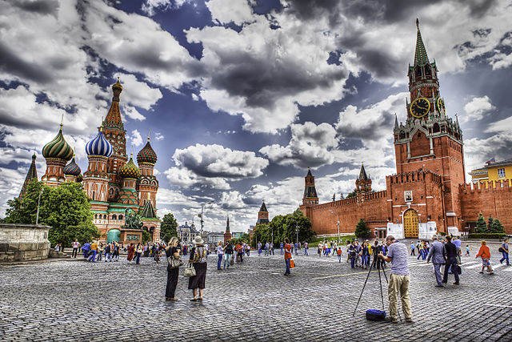
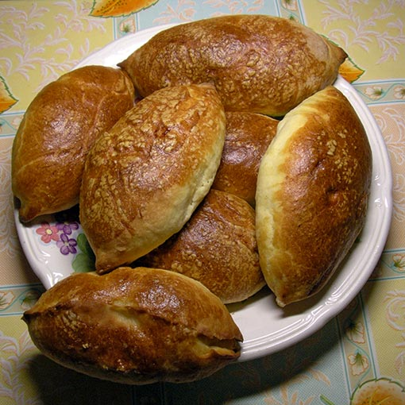

<h1>Russian Culture</h1>

Information on Russian Culture

<iframe width="560" height="315" src="https://www.youtube.com/embed/mORJmK1Ljgk" frameborder="0" allow="accelerometer; autoplay; clipboard-write; encrypted-media; gyroscope; picture-in-picture" allowfullscreen></iframe>

<h2>Lake Baikal</h2>

The example on this page shows image and text arranged in two columns

<!-- 
COMMENTS: The code below is for a two column layout with image on the left and text on the right.
The page is divided into 12 possible units. So in this example, the left column is 5 units wide and the right column is 7 units wide. This is done using the col-sm-5 and col-sm-7, which you can see below. 
If you want the image column and text column to be equal widths, change both col-sm entries to col-sm-6 each. You can try different numbers as long as the two numbers are equal to 12.
I've also included paragraph tags and bullet list tags in the text section, so you can see how they work.
END OF COMMENTS --> 
<!-- Copy all of the code from below here -->

    

      
    

    

    
 Red Square....

Facts about Russia:

<ul>
    <li>Population: (2020)</li>
    <li>Capital: </li>
    <li>Name: </li>
    <li>Language: </li>
    <li>Currency: </li>       
</ul>
   

  

&nbsp;

    

      
    

    

    
 Red Square....

Facts about Russia:

<ul>
    <li>Population: (2020)</li>
    <li>Capital: </li>
    <li>Name: </li>
    <li>Language: </li>
    <li>Currency: </li>       
</ul>
   

  

  
  
  
&nbsp;

  
  

    

      
    

    

    
 Red Square....

Facts about Russia:

<ul>
    <li>Population: (2020)</li>
    <li>Capital: </li>
    <li>Name: </li>
    <li>Language: </li>
    <li>Currency: </li>       
</ul>
   

  

  
  

    

      
    

    

    
 Red Square....

Facts about Russia:

<ul>
    <li>Population: (2020)</li>
    <li>Capital: </li>
    <li>Name: </li>
    <li>Language: </li>
    <li>Currency: </li>       
</ul>
   

  

  
  
  
&nbsp;

